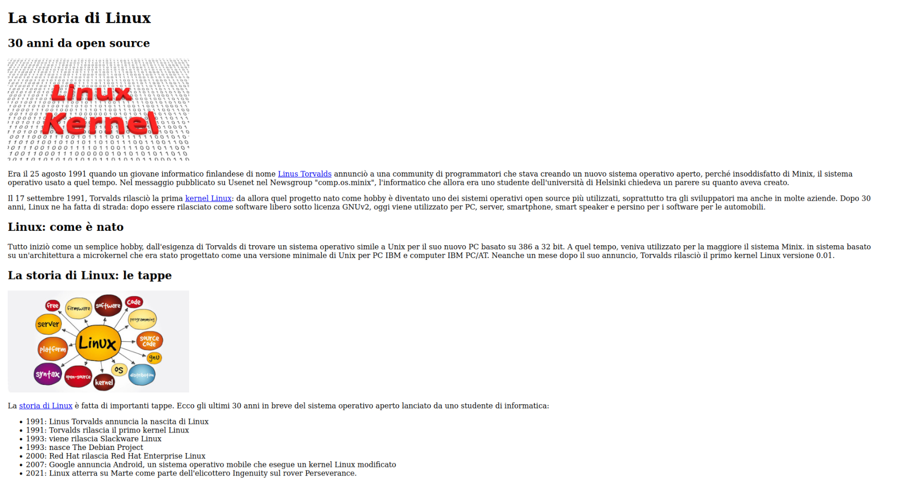

# Laboratorio 1: struttura

## Descrizione del laboratorio
Gli obiettivi di questo primo laboratorio sono quelli di:

- definire i tag fondamentali di una pagina Html
- definire la struttura del testo
- inserire immagini
- inserire collegamenti ipertestuali esterni

### Attività da svolgere

I passi da svolgere per il laboratorio sono i seguenti:

Strutturare il testo all'interno del file `index.html` per ottenere un risultato simile a questo:

### Indicazioni puntuali per la strutturazione del documento
#### Titoli e sottotitoli
Il titolo principale va formattato con `h1`
I sottotitoli vanno formattati con `h2`

##### Immagini
- Immagine 1: `images/linux-kernel.jpg`
- Immagine 2: `images/linux.jpg`

#### Collegamenti:
- Linux Torvalds: https://en.wikipedia.org/wiki/Linus_Torvalds
- kernel Linux: https://en.wikipedia.org/wiki/Linux_kernel
- Storia di Linux: https://it.wikiversity.org/wiki/Storia_di_Linux

## Risultato atteso

